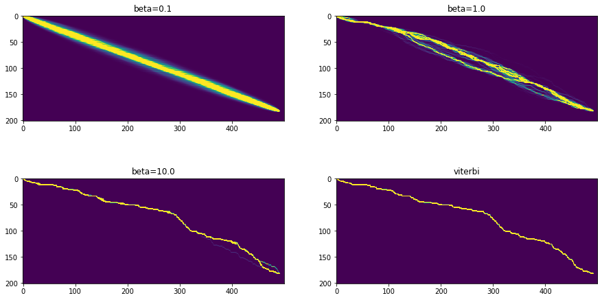

# MCTC
> Matrix-valued and banded extensions of the CTC loss in pytorch and cupy.


## Install

`pip install your_project_name`

## How to use

Compare against builtin pytorch loss:

```
sample_inputs = logits, targets, input_lengths, target_lengths = generate_sample_inputs(T_min=450, T_max=500, N=128, C=20, L_min=80, L_max=100)
(ctc_loss_pytorch(*sample_inputs).item(), ctc_loss_cupy(*sample_inputs).item())
```


    (12.813830375671387, 12.813830375671387)


Speed comparison:

```
report(benchmark_fwd_bwd(ctc_loss_pytorch, *sample_inputs))
```

    fwd: 4.98ms (4.22-5.52ms)
    bwd: 10.26ms (9.08-11.11ms)
    tot: 15.24ms (13.99-16.58ms)


```
report(benchmark_fwd_bwd(ctc_loss_cupy, *sample_inputs))
```

    fwd: 6.44ms (6.15-7.04ms)
    bwd: 5.16ms (4.97-5.80ms)
    tot: 11.59ms (11.19-12.77ms)


Soft and hard alignments:

```
betas = [0.1, 1.0, 10.]
alignments = {f'beta={beta:.1f}': to_np(soft_alignments(*sample_inputs, beta=beta)) for beta in betas}
alignments['viterbi'] = to_np(viterbi_alignments(*sample_inputs))
fig, axs = plt.subplots(2, 2, figsize=(15, 8))
for (ax, (title, data)) in zip(np.array(axs).flatten(), alignments.items()):
    ax.imshow(data[:, 0].T, vmax=0.05);
    ax.set_title(title)  
```




